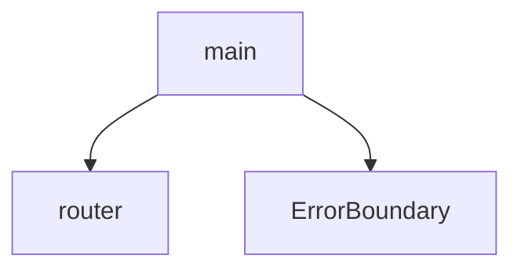
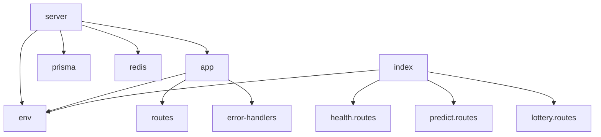
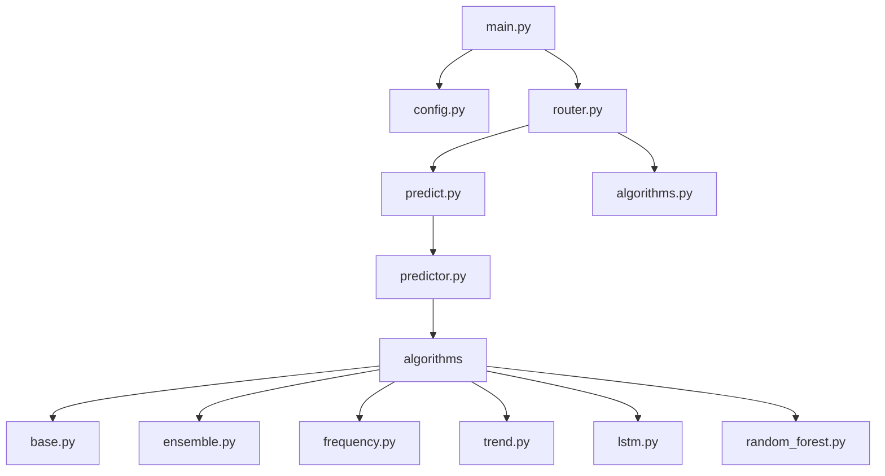
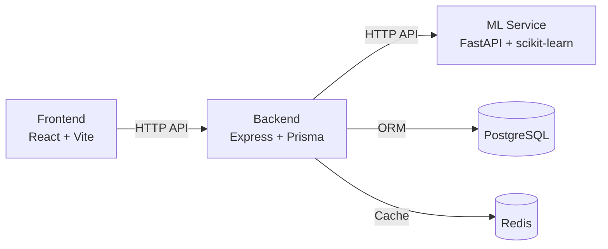

# 依赖关系图 (DEPENDENCY_GRAPH)

> 📅 生成时间: 2025-12-23T09:38:07.062Z

## 🎯 Frontend 模块依赖

```mermaid
graph TD
  main[main] --> router[router]
  main[main] --> ErrorBoundary[ErrorBoundary]
```

## 🎯 Backend 模块依赖

```mermaid
graph TD
  server[server] --> app[app]
  server[server] --> env[env]
  server[server] --> prisma[prisma]
  server[server] --> redis[redis]
  app[app] --> env[env]
  app[app] --> routes[routes]
  app[app] --> error-handlers[error-handlers]
  index[index] --> env[env]
  index[index] --> health.routes[health.routes]
  index[index] --> predict.routes[predict.routes]
  index[index] --> lottery.routes[lottery.routes]
```

## 🎯 ML Service 模块依赖

```mermaid
graph TD
  main[main.py] --> config[config.py]
  main --> api_router[router.py]
  api_router --> predict[predict.py]
  api_router --> algorithms_api[algorithms.py]
  predict --> predictor[predictor.py]
  predictor --> algorithms[algorithms]
  algorithms --> base[base.py]
  algorithms --> ensemble[ensemble.py]
  algorithms --> frequency[frequency.py]
  algorithms --> trend[trend.py]
  algorithms --> lstm[lstm.py]
  algorithms --> random_forest[random_forest.py]
```

## 🔗 跨模块依赖

```mermaid
graph LR
  Frontend[Frontend<br/>React + Vite] -->|HTTP API| Backend[Backend<br/>Express + Prisma]
  Backend -->|HTTP API| MLService[ML Service<br/>FastAPI + scikit-learn]
  Backend -->|ORM| Database[(PostgreSQL)]
  Backend -->|Cache| Redis[(Redis)]
```

---

*本依赖图由 project-multilevel-index 自动生成*
